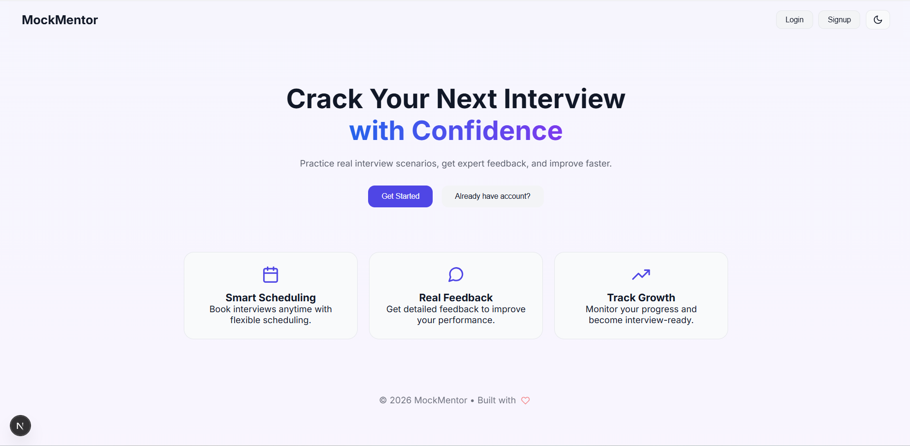
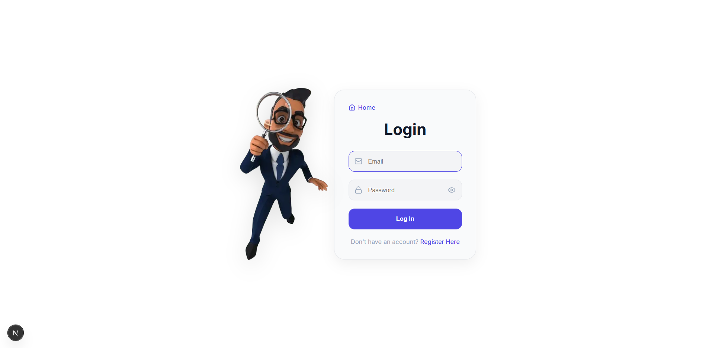
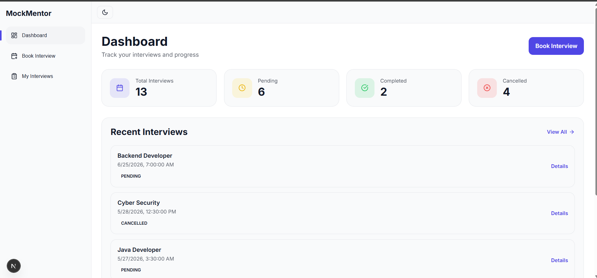
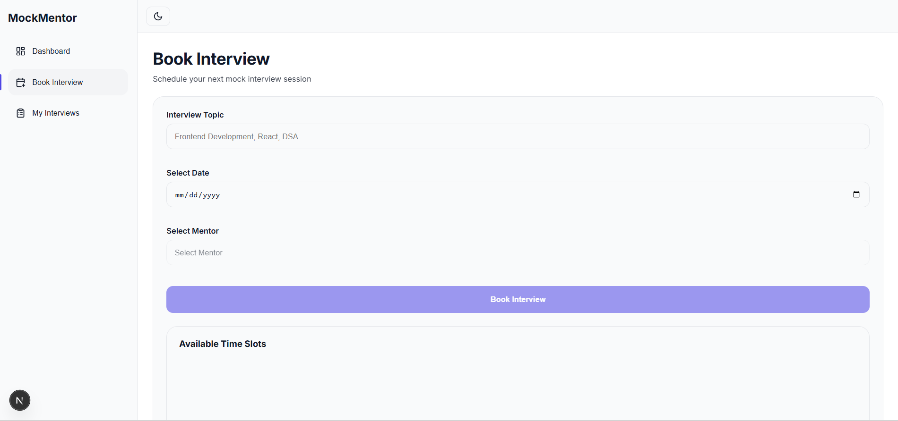

# MockMentor

**A production-grade full-stack mock interview booking platform** that connects students with mentors for scheduled interview practice sessions.

[](https://mockmentor-flame.vercel.app/)
[](https://nextjs.org/)
[](https://neon.tech/)
[](https://vercel.com/)

---

## Screenshots

### Landing Page


### Login


### Student Dashboard


### Book Interview


### My Interviews


---

## Features

**Student**
- Book mock interviews by selecting topic, date, mentor, and time slot
- Real-time slot availability — already booked slots are automatically disabled
- View full interview history with status tracking (Pending, Accepted, Rejected, Completed, Cancelled)
- Reschedule or cancel upcoming interviews
- Receive automated email confirmations on booking events

**Mentor**
- Configure weekly working hours and availability
- Accept or reject incoming interview requests
- Submit structured feedback after completed sessions
- View full session history from a dedicated dashboard

**Admin**
- Manage all users and assign or change roles
- View and manage all interviews across the platform
- Access analytics dashboard with platform-wide stats

---

## Tech Stack

| Layer | Technology |
|---|---|
| Frontend | Next.js 16 (App Router), React, Tailwind CSS |
| Backend | Next.js API Routes (Node.js) |
| Database | PostgreSQL (Neon Serverless) |
| ORM | Prisma |
| Authentication | Custom JWT with HTTP-only cookies |
| Data Fetching | SWR |
| Validation | Zod |
| Email | Resend |
| Deployment | Vercel |

---

## Architecture Highlights

- **Role-based access control** — Student, Mentor, and Admin roles enforced at middleware level across all routes
- **20+ REST API endpoints** with centralized error handling and standardized response structure
- **Conflict detection** — scheduling system prevents double-bookings by checking existing reservations before confirming slots
- **Security** — rate limiting on auth endpoints, HTTP-only cookies, Zod input validation, SWR cache cleared on logout to prevent cross-user data leaks
- **Database** — composite indexes and cascade delete rules prevent N+1 queries and orphaned records

---

## Demo Credentials

You can explore the platform without signing up using these test accounts:

| Role | Email | Password |
|---|---|---|
| Student | yashwanththalka119@gmail.com | 123456 |
| Mentor | akshay123@gmail.com | 123456 |
| Admin | ranjith@admin.com | admin1234 |

> These are read-access demo accounts for evaluation purposes.

---

## Getting Started (Local Setup)

### Prerequisites

- Node.js 18+
- PostgreSQL database (or a free [Neon](https://neon.tech/) account)
- [Resend](https://resend.com/) account for email (free tier works)

### Installation

```bash
# Clone the repository
git clone https://github.com/Yashwanth2424/mockmentor.git
cd mockmentor

# Install dependencies
npm install

# Set up environment variables
cp .env.example .env
# Fill in your values in .env (see below)

# Push Prisma schema to your database
npx prisma db push

# Generate Prisma client
npx prisma generate

# Start the development server
npm run dev
```

Open [http://localhost:3000](http://localhost:3000) in your browser.

### Environment Variables

```env
# Database
DATABASE_URL=your_postgresql_connection_string

# Auth
JWT_SECRET=your_jwt_secret_key

# Email (Resend)
RESEND_API_KEY=your_resend_api_key

# App URL
NEXT_PUBLIC_APP_URL=http://localhost:3000
```

---

## Project Structure

```
src/
├── app/
│   ├── api/          # 20+ REST API route handlers
│   ├── dashboard/    # Student dashboard pages
│   ├── mentor/       # Mentor dashboard pages
│   ├── admin/        # Admin panel pages
│   ├── login/        # Authentication pages
│   └── signup/
├── components/       # Reusable UI components
├── lib/
│   ├── prisma.js     # Prisma client instance
│   ├── auth.js       # JWT utilities
│   ├── validators.js # Centralized Zod schemas
│   └── mailer.js     # Resend email helpers
└── middleware.js     # Route protection and role enforcement
```

---

## Roadmap

- [ ] TypeScript migration (branch: `typescript-migration`)
- [ ] Unit tests with Jest and React Testing Library
- [ ] Mentor rating and review system
- [ ] Calendar view for interview scheduling

---

## Author

**Thalka Yashwanth**
M.Sc. Web Engineering — TU Chemnitz, Germany

[](https://linkedin.com/in/thalka-yashwanth)
[](https://yashwanth2424.github.io/My-Portfolio/)