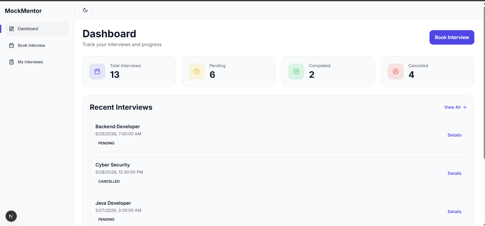
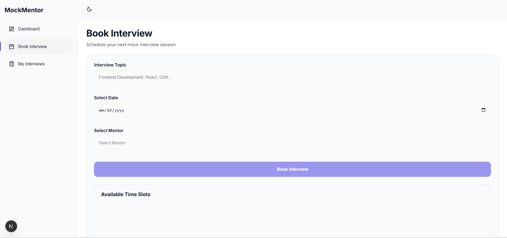

# MockMentor

MockMentor is a web app where students can book mock interviews with mentors. I built it to practice full-stack development with Next.js, Prisma and PostgreSQL.

Live demo: https://mockmentor-flame.vercel.app

## What it does

There are three roles: student, mentor and admin.

**Students can:**
- book an interview by choosing a topic, a date, a mentor and a time slot
- see their interviews and the status (pending, accepted, rejected, completed, cancelled)
- reschedule or cancel an interview
- read the mentor's feedback after the interview
- get a confirmation email when they book

**Mentors can:**
- set the hours they are available for each day of the week
- accept or reject booking requests
- mark an interview as completed and give feedback (rating, strengths, things to improve)

**Admins can:**
- see all users, change their role or delete them
- see all interviews and update or cancel them
- see simple counts of total, pending and completed interviews

## Screenshots

**Student dashboard**



**Booking an interview**


**My interviews**



More: [landing page](screenshots/landing.png), [login page](screenshots/login.png)

## Tech stack

- Next.js 16 (App Router) with React and plain CSS
- Next.js API routes for the backend
- PostgreSQL on Neon, with Prisma as the ORM
- Login with JWT stored in an HTTP-only cookie
- SWR for fetching data on the client
- Zod for validating request data
- Resend for sending emails
- Deployed on Vercel

## How some things work

**Roles and access.** `src/proxy.js` checks the login cookie and the role before a page or API route is opened. Each API route also checks the user again, so the API is protected even without the proxy.

**No double booking.** A mentor or a student should never have two active interviews at the same time. The API first checks for a conflict to show a clear error message. But two requests can arrive at the same moment and both pass that check, so the real protection is in the database: two partial unique indexes on `(mentorId, date)` and `(userId, date)`, only for interviews that are PENDING or ACCEPTED. If two bookings for the same slot come in together, PostgreSQL accepts the first one and rejects the second, and the API returns a 409 error. Cancelled or rejected interviews do not block the slot.

Note: Prisma 5 cannot describe partial indexes in `schema.prisma`, so they only exist in the migration file. If a future `prisma migrate dev` tries to drop them, remove those `DROP INDEX` lines from the new migration.

**Other details:**
- passwords are hashed with bcrypt
- API responses always look like `{ success, data }` or `{ success, error }`
- simple rate limiting on login, signup and booking
- the SWR cache is cleared when a user logs out

## Demo accounts

You can try the app with these accounts:

| Role | Email | Password |
|---|---|---|
| Student | yashwanththalka.example@gmail.com | 123456 |
| Mentor | akshay123@gmail.com | 123456 |

The admin panel is not public. The admin features are listed above.

## Run it locally

You need Node.js 20.9 or newer and a PostgreSQL database (a free Neon account works). For emails you also need a Resend API key.

```bash
git clone https://github.com/Yashwanth2424/mockmentor.git
cd mockmentor
npm install

# copy the example env file and fill in your values
cp .env.example .env

# create the tables
npx prisma migrate deploy

# create the two demo accounts
npx prisma db seed

npm run dev
```

Then open http://localhost:3000.

The `.env` file needs these values:

```env
DATABASE_URL=your_postgresql_connection_string
JWT_SECRET=a_random_string_of_at_least_32_characters
RESEND_API_KEY=your_resend_api_key
NEXT_PUBLIC_APP_URL=http://localhost:3000
```

## Project structure

```
src/
├── app/
│   ├── api/          # API routes
│   ├── dashboard/    # student pages
│   ├── mentor/       # mentor page
│   ├── admin/        # admin pages
│   ├── login/
│   └── signup/
├── components/       # header, sidebar, skeleton loaders, theme toggle
├── lib/
│   ├── prisma.js      # Prisma client
│   ├── auth.js        # password hashing and login checks
│   ├── adminAuth.js   # admin check
│   ├── jwt.js         # create and verify tokens
│   ├── validators.js  # Zod schemas
│   ├── apiResponse.js # helpers for API responses
│   ├── rateLimit.js   # rate limiting
│   ├── env.js         # checks the environment variables
│   └── email.js       # sending emails with Resend
└── proxy.js           # checks login and role before a route is opened
```

## What I learned

- A check in the code is not enough to stop double bookings. Two requests can pass the check at the same time, so I added unique indexes in the database and tested it by sending two bookings at once.
- How Prisma migrations work, and why I test a migration on a copy of the database (a Neon branch) before running it on production.
- How login with JWT and HTTP-only cookies works, and why the API routes check the user again and do not only trust the proxy.
- To only send the data the page needs. At first some API responses included the password hash of users, and I changed them to return only id, name and email.
- My validation code used `error.errors`, which does not exist in Zod 4 (it is called `error.issues`). Because of that, every wrong input returned a server error instead of a clear message. Now I also test what happens with wrong input, not only with correct input.

## Known limitations

- The rate limiter keeps its counts in memory. On Vercel every server instance has its own memory, so the limit is not reliable there. A shared store like Redis would fix this.
- All times use German time (Europe/Berlin). There is no timezone setting per user yet.
- Emails are sent with Resend's test sender, so they only reach the email address of the Resend account.
- There are no automated tests yet.

## Next steps

- [ ] Move the project to TypeScript
- [ ] Add tests with Jest and React Testing Library
- [ ] Let students rate their mentors
- [ ] Add a calendar view for interviews

## Author

Thalka Yashwanth, M.Sc. Web Engineering student at TU Chemnitz, Germany

- LinkedIn: https://www.linkedin.com/in/thalka-yashwanth
- Portfolio: https://yashwanth2424.github.io/My-Portfolio/
